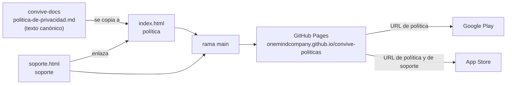

# convive-politicas

Política de privacidad y página de soporte **públicas** de las apps móviles de Convive (Android e iOS),
servidas con GitHub Pages para Google Play y App Store. Titular: **Factor Escuela SpA**
(contacto@factorescuela.cl).

| Página | URL | La declara |
|---|---|---|
| Política de privacidad | https://onemindcompany.github.io/convive-politicas/ | Google Play y App Store (URL de política de privacidad) |
| Soporte | https://onemindcompany.github.io/convive-politicas/soporte.html | App Store (URL de soporte) |

Las dos tiendas exigen una política accesible sin iniciar sesión, y Apple además una URL de soporte.
Mismo esquema que `suscripcion-politicas`.

## Fuente de verdad

El texto canónico de la política vive en `convive-docs/politica-de-privacidad.md`, y `index.html` es su
espejo. **Los cambios se hacen allá primero** y esta página se actualiza en el mismo cambio. Si
divergen, la declaración pública deja de coincidir con la interna, y eso es un problema legal. Las
fichas de las tiendas están en `convive-docs/publish-android/` y `convive-docs/publish-ios/`.

## Desviaciones del estándar de repositorios

Las mismas dos de `suscripcion-politicas`, deliberadas y acotadas:

1. **Es público**: su única razón de existir es que las tiendas y los usuarios puedan leerlo. No
   contiene código de producto.
2. **El commit inicial incluye las páginas**, no solo el README: GitHub Pages sirve desde `main`, y un
   repo de política sin política no publica nada.

## Dependencias

No depende de ningún servicio de Convive: son páginas estáticas, sin scripts ni recursos externos.

## Ramas

| Rama | Rol | Protegida |
| --- | --- | --- |
| `main` | Producción / versión publicada | ✅ |
| `qa` | Validación | ✅ |
| `develop` | Integración del trabajo en curso | ✅ |
| `feature/*` | Trabajo puntual, se integra a `develop` vía PR | ❌ |

Como Pages sirve desde `main`, un cambio de política no está publicado hasta que llega a `main` por
el flujo normal.
